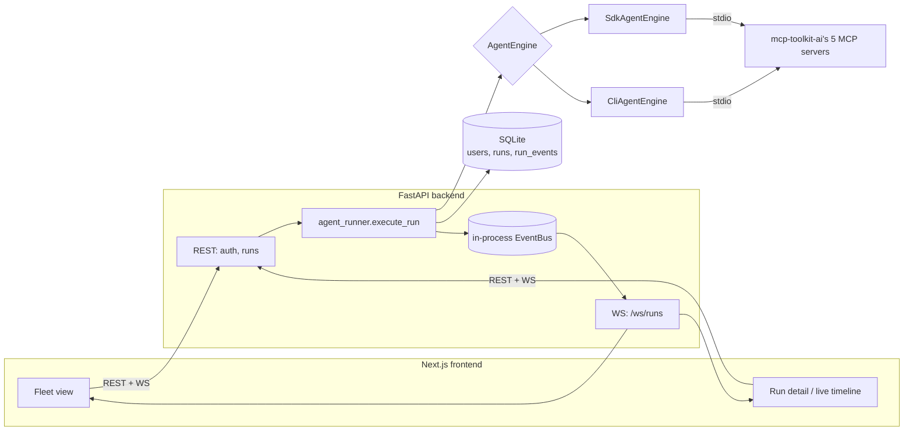

# agent-ops-dashboard

Submit a task in plain English, and watch a Claude-powered agent work it — live. Every tool
call, every result, every step of the reasoning, streamed to a dashboard as it happens, with
multiple independent agent runs able to be in flight at once.

Capstone (project 4) of a 2026 portfolio series — see [docuchat-ai](https://github.com/rlphjyson/docuchat-ai)
(RAG chat), [prreview-ai](https://github.com/rlphjyson/prreview-ai) (AI PR review), and
[mcp-toolkit-ai](https://github.com/rlphjyson/mcp-toolkit-ai) (5 MCP servers + CLI — this
dashboard's agents call those same servers as tools).

## What makes this one different

Project 3 was deliberately protocol-only, with no UI, to demonstrate MCP servers on their own
terms. This capstone returns to the fullstack shape of projects 1–2 and ties the series together:
it's the thing that actually *drives* mcp-toolkit-ai's servers, with a real-time, multi-run
dashboard as the payoff.

## Dual agent engine

Agents run through one of two engines, chosen automatically:

- **`ANTHROPIC_API_KEY` set** → the official [Claude Agent SDK](https://github.com/anthropics/claude-agent-sdk-python),
  with native MCP server wiring and a native streamed event iterator.
- **No key** → a `claude` CLI subprocess in headless mode
  (`claude -p --output-format stream-json --mcp-config ... --tools "" --allowedTools "mcp__name__*"`),
  reusing whatever Claude Code subscription login is already on the machine.

Both normalize their output into the same internal event stream, so persistence, the WebSocket
relay, and the frontend never know or care which engine produced an event.

This split exists because the SDK itself only supports API-key auth (confirmed directly against
its installed source, not assumed) — subscription reuse only works by shelling out to the CLI.
A live spike also found that a bare, key-less SDK call does **not** properly sandbox the agent's
tool surface (it leaked the full ambient Claude Code tool set), while the CLI engine's
`--tools "" --allowedTools` combination is confirmed, live, to sandbox correctly — which is
exactly why the CLI path was chosen for subscription reuse in the first place, not a coincidence.

## Architecture



### Request flow

1. **Submit a task** — `POST /runs` creates a `Run` row and returns immediately (`202`); the
   actual work happens as a FastAPI background task, so multiple runs genuinely execute
   concurrently (all on one event loop — see Production notes).
2. **The agent works** — `agent_runner.execute_run` resolves mcp-toolkit-ai's real `servers.toml`
   (from a sibling checkout, or `MCP_TOOLKIT_PATH`), builds the chosen `AgentEngine`, and
   iterates its event stream, persisting a `RunEvent` row per event and publishing it to an
   in-process `EventBus`.
3. **Live relay** — a single `WS /ws/runs` endpoint (optionally filtered by `?run_id=`) fans out
   published events to every connected client. A filtered connection backfills that run's full
   history first; the unfiltered fleet view skips backfill (it already has `GET /runs` for
   initial state) and only gets the live tail.
4. **Dashboard** — the fleet page shows every run's live status; a run's detail page renders an
   ordered timeline of tool calls, results, reasoning, and the final outcome.

## Tech stack

| Layer | Choice | Why |
| --- | --- | --- |
| Agent engine | Claude Agent SDK / `claude` CLI subprocess | See "Dual agent engine" above. |
| Backend | FastAPI + SQLModel | Same pattern as the rest of the series. |
| DB | SQLite (default) / Postgres-ready | Same SQLAlchemy-URL upgrade path as projects 1–2. |
| Live relay | Native WebSocket, in-process pub/sub | One connection type for both the fleet view and a run's live tail — see Production notes for the single-worker constraint this implies. |
| Frontend | Next.js App Router + TS + Tailwind + shadcn | Matches projects 1–2. `lib/useRunEvents.ts` is the one genuinely new frontend pattern in the series versus the siblings' SSE-over-fetch approach. |
| Auth | JWT (PyJWT + bcrypt) | Ported from `docuchat-ai` — required here, not optional, since a submitted task can run test commands and read allowlisted directories on the host. |

## Getting started

Clone this repo **as a sibling of `mcp-toolkit-ai`** (the default `MCP_TOOLKIT_PATH` fallback
assumes `../mcp-toolkit-ai` relative to this repo; set the env var explicitly if you keep a
different layout):

```
projects/
  agent-ops-dashboard/
  mcp-toolkit-ai/        # needs its own .venv with all 5 servers installed -- see its README
```

```bash
cd backend
python -m venv .venv && .venv/Scripts/activate   # or source .venv/bin/activate
pip install -e ".[dev]"
uvicorn app.main:app --reload --port 8000
```

```bash
cd frontend
npm install
npm run dev
```

Set `ANTHROPIC_API_KEY` to use the Agent SDK engine; leave it unset (with a `claude` CLI already
logged into a Claude Code subscription) to use the CLI engine instead.

## Testing

- Every backend test goes through the `AgentEngine` Protocol seam — a `FakeAgentEngine` yields
  canned events, so the large majority of tests make zero real API calls and spawn zero real
  `claude` subprocesses, regardless of which real engine is configured.
- One real, cross-repo end-to-end test opens a genuine `ClientSession` against a really-spawned
  `issue_tracker` subprocess from the actual sibling `mcp-toolkit-ai` checkout (with its own
  `ISSUE_TRACKER_FAKE_GITHUB=1` fake-client gate) — validates `servers.toml` resolution and real
  subprocess spawn without spending money or touching real GitHub. CI checks out both repos to
  run it for real on every push.
- The CLI engine's stream-json parser is tested against **real, captured transcripts** (not
  hand-written fixtures) — including one caught live, mid-build: a dict-returning MCP tool
  produces a different `tool_use_result` shape than a list-returning one, which the parser
  originally didn't handle (see the technical writeup for the full story).
- No CI test makes a real Anthropic API call or spawns a real `claude` process — both engines'
  true end-to-end behavior is verified manually, locally, once per engine.
- Frontend: Vitest + Testing Library, including a hand-rolled fake `WebSocket` driving
  `useRunEvents` through connect/message/reconnect/dedupe without a real socket.

## Production notes

This is tuned for a local, single-developer demo, not a production deployment:

- **Single Uvicorn worker required.** The in-process `EventBus` and "concurrent runs share one
  event loop" design only work with one worker process; a real multi-worker deployment would
  need Redis pub/sub or similar instead.
- **No per-user engine/credential choice.** Engine selection is a single, app-level
  `ANTHROPIC_API_KEY` presence check, not a per-user "connect your own Claude account" flow like
  `prreview-ai`'s. A real multi-tenant version would need that.
- **Best-effort cost/turn caps.** `--max-budget-usd`/`--max-turns` bound the CLI engine; no
  equivalent has been confirmed for the SDK engine yet (open follow-up).

## License

[MIT](LICENSE)
